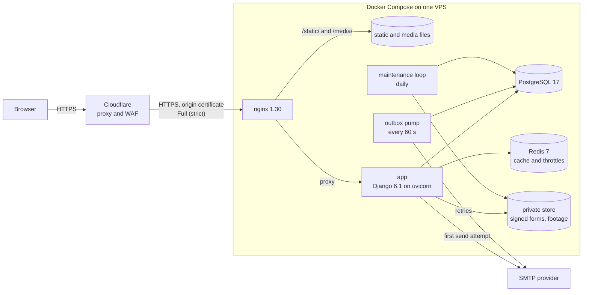

# Studio platform: a case study

A production Django platform I built, freelance, for a yoga school in Israel. It replaced the school's WordPress and WooCommerce site with one server-rendered system that a non-technical owner runs from a phone. It has a Hebrew-first right-to-left site, a phone-first staff CMS, subscriptions with manually confirmed payments, signed private video, and live classes broadcast from a browser with no media server.

**The source code is private.** It is client work, and the repository holds the client's own content. This repository describes the design, the security model, the deployment and the tests. It contains no code from the project and no client data. The school is not named because it has not approved being named.

Author: Alex Isaev

## At a glance

| | |
|---|---|
| Stack | Python 3.14, Django 6.1 on ASGI (uvicorn), PostgreSQL 17, Redis 7, nginx 1.30, Docker Compose, Cloudflare |
| Shape | One Django project, 8 apps, server-rendered templates, vanilla JavaScript, no Node toolchain |
| Size | About 44,000 lines: 21,000 of Python (8,300 of them tests), 6,900 of templates, 10,900 of CSS in 40 modules, 4,700 of JavaScript in 28 modules. Migrations, translation catalogues and one-off content-import commands are not counted. |
| Tests | 647 Django test methods in 41 test modules, plus two in-browser layout harnesses |
| Timeline | 170 commits from 22 August to 28 September 2026 |
| Team | One developer |

## Why it is interesting to an engineer

- **Live classes with no media server.** The teacher's browser cuts the camera into 4-second WebM segments with `MediaRecorder` and uploads them strictly in order. Viewers fetch the same segments and append them to a Media Source Extensions buffer. The segment directory is the recording. See [docs/live-classes.md](docs/live-classes.md).
- **A transactional email outbox instead of a task queue.** Every message is a database row before it is an SMTP conversation. Rows are claimed with one atomic `UPDATE`, retried on a backoff ladder whose last rung repeats, and swept back if a process dies mid-send. See [docs/outbox.md](docs/outbox.md).
- **Private video that only plays on its own page.** Files have no public URL. Each page view mints an HMAC-signed address that expires after 6 hours, is accepted only for same-origin fetches, and serves HTTP Range requests with correct 206 and 416 answers.
- **Signup that creates nothing until the address is proven.** The join form writes a pending row with an already-hashed password. A `User` exists only after a 6-digit code or a magic link comes back, and a single `UPDATE` makes the code and the link racing each other produce one account.
- **Security from the edge to the view.** Cloudflare, nginx, Django settings and the views each carry their own controls, and the config fails closed. See [docs/security-model.md](docs/security-model.md).
- **A CMS for one non-technical person on a phone.** Every action is a plain form POST that works without JavaScript; with JavaScript the editor becomes a document you type into.

## The problem

The school ran on WordPress with WooCommerce. An audit of the old site found:

- no draft state in practice, so a half-written page went live on save;
- a weekly timetable typed by hand as a fixed-width HTML table that ran off a phone screen;
- a shop that sold physical products but no classes, and no way to buy a subscription online;
- no cache headers on static files, no compression and no security headers.

The owner teaches yoga and is not technical. The brief was a site the owner can run from a phone, in Hebrew first, without ever opening a terminal. The school takes money through a mobile wallet that has no API and no webhook, as well as cash, cheques and bank transfers, and it wanted to stream classes to subscribers. The site would be handed to a teacher rather than a dev team, so every dependency is pinned to an exact version and upgraded on purpose.

## What it does

**Public site**
- Hebrew-first and right-to-left. Russian and English are wired in (gettext catalogues, per-language model columns, language-prefixed URLs) but switched off until the school decides. Turning them on is one line in settings.
- Home page, practice pages built from ordered content blocks, a teacher-training course, teacher profiles, studio pages with embedded maps, a weekly timetable, a journal of articles, events and galleries, a shop catalogue without checkout, and a prices page.

**Student accounts**
- Deferred signup confirmed by a 6-digit code or a magic link. Login and password reset are rate-limited.
- A mandatory participation form with health questions and a signature drawn on a canvas. The server re-encodes the signature, renders the form to a Hebrew PDF with WeasyPrint, and keeps it in a private store. A middleware walks a confirmed student back to the form from every page until it is signed.
- A dashboard of passes and expiry dates, and account notices delivered to any open tab.

**Passes and payments**
- Products cover a single class, class packs, unlimited periods, trials and private sessions. A subscription can be bought by the month or by the year at a reduced monthly rate.
- A student chooses a subscription, lands on a page showing the exact sum with a plain link to the school's wallet, and can mark it as paid. The owner checks the wallet and opens the pass from the panel.
- Cash, cheques and transfers are recorded through the same `issue()` service, so the list of who has paid cannot drift from the money. A renewal starts the day after the current pass ends, and months are calendar months.

**Video and live classes**
- The school's own footage streams from private storage through signed, expiring, same-origin URLs.
- The owner broadcasts from a browser and sees who is watching. Subscribers whose pass includes streaming watch live or from a 30-day archive, with live comments.

**Staff panel**
- Phone-first, at `/manage/`. It covers articles and shop items in a block editor, events, the weekly schedule, prices, studio addresses, contact details, practice pages, and students and payments.
- Deleting is its own page, never a click. Changing a student's name, email or phone shows old and new values and needs a second press.
- Files upload one at a time as soon as they are chosen, with a progress bar. They wait under a token until Save, and unclaimed ones are swept after a day.

**Email**
- Transactional mail (codes, resets, a pass opened) and opt-in letters (a new event, a schedule change, a class going live) go through the outbox. Letters are rendered in Hebrew, with HTML and plain-text parts.

## Architecture

| App | Responsibility |
|---|---|
| `accounts` | Email-keyed user, pending signups, verification codes, throttles, participation form and its PDF, account notices, letter audiences |
| `catalog` | Studios, teachers, practices, the teacher-training course, the block composition engine, signed video serving |
| `core` | Email outbox and mailer, CSP and Permissions-Policy middleware, image pipeline, private storage, asset bundler, shared models |
| `journal` | Articles as ordered typed blocks, events, galleries, held uploads |
| `live` | Segment ingest, playlist, segment serving, comments and presence |
| `panel` | The staff CMS |
| `shop` | Product shelf, no checkout |
| `studio` | Weekly class templates materialised into dated classes, pass products, pass requests, the `issue()` service |

Key choices:

- **One monolith, server-rendered.** No SPA and no API layer. Each page is a Django template, and 28 small JavaScript modules enhance it. The staff panel and the sign-in forms keep working without them.
- **PostgreSQL enforces the rules.** Check constraints (a class ends after it starts, a content block belongs to exactly one page) and unique constraints (one dated class per template and day, and a partial one allowing a single open payment request per student) back up the code. Races are closed with atomic `UPDATE` claims and `select_for_update`.
- **Redis is a cache, not a store.** It backs the cache, the throttles and the cached-database session backend. Sessions live in PostgreSQL, so evicting Redis never logs anyone out.
- **No task queue.** The outbox pump and a daily maintenance loop run from the same image as the app.
- **No front-end toolchain.** A 130-line Python bundler folds 40 CSS and 28 JavaScript modules into one minified file each and rebuilds them when a source changes. It also runs at container start, just before `collectstatic`, so the manifest storage hashes the fresh bundle.

More detail, including the data model: [docs/architecture.md](docs/architecture.md).

## Security model

| Layer | Controls |
|---|---|
| Edge | Cloudflare proxy and WAF. TLS to the origin in Full (strict) mode with an origin certificate whose key was generated on the server and is mounted read-only, never baked into an image. |
| nginx | Restores the client IP from `CF-Connecting-IP` only for Cloudflare's ranges, then overwrites `X-Forwarded-For`, so a client cannot spoof its address into the app's rate limiter. POST-only rate limits on sign-in, join, password reset, the email check and `/admin/`, answered with 429. A 2 MB body limit everywhere except the panel (100 MB) and live ingest (30 MB). `Content-Security-Policy: default-src 'none'; sandbox` and `nosniff` on uploaded media. The private store is never mounted into the nginx container. |
| Configuration | `DEBUG` is off unless set. The app refuses to boot with a missing or placeholder `SECRET_KEY` when `DEBUG` is off. Secure cookies, HSTS for a year over HTTPS, `X-Frame-Options: DENY`. Every link in an email is built from a configured site URL, never the `Host` header. |
| Response headers | A fresh CSP nonce per request: `script-src 'self' 'nonce-…'`, `object-src 'none'`, `frame-ancestors 'none'`, `form-action 'self'`, `base-uri 'self'`. A Permissions-Policy that allows camera and microphone to this origin only, for the broadcaster. |
| Authentication | Constant-time code comparison, attempts counted on the database row, 7-minute codes. Throttles per account (8 failures) and per IP (30) in a 15-minute window, then a 10-minute pause; separate per-IP limits on join, reset and the email check. MX lookup on signup. Reset links last 3 hours. `next=` redirects are checked against the host. |
| Authorisation | One predicate, `is_school_admin`, guards the panel, the broadcast controls and the signed forms. The panel answers 404, not 403, to anyone else. Student-management screens look people up through the student roll, so changing an ID in the URL cannot reach an admin account. Uploaded files are claimed by token and owner together. |
| Files | Private storage whose `url()` raises, so a template cannot leak a link by accident. Signed forms are served only by a view that checks who is asking, and footage only through signed, expiring URLs. Uploaded photographs are re-encoded to WebP with EXIF, GPS and colour-profile data dropped; a file that already arrives as WebP is kept as sent. Panel uploads are also capped at 60 megapixels and checked with Pillow's `verify()` before anything decodes them, and documents and audio are checked against an allow-list. Deleting a student from the panel removes their photo, signature and PDF from disk. |
| Containers and supply chain | Non-root app user. Secrets arrive at runtime and are excluded from the build context. Redis requires a password even on the private network. Log rotation caps. 13 direct dependencies, all pinned to exact versions, with the reasons for the image-decoder versions written beside them. `pip-audit` scans the installed packages, not just the pins, in a throwaway container. `ruff` runs with the bandit (`S`), naive-datetime (`DTZ`) and blind-except (`BLE`) rule sets. |

The full write-up, including the trade-offs I chose deliberately, is in [docs/security-model.md](docs/security-model.md).

## Deployment

Six services in one Compose file. A dev overlay layers on top automatically on a laptop; production runs the base file alone.

| Service | Role |
|---|---|
| `postgres` | PostgreSQL 17, health-checked |
| `redis` | Redis 7, password-protected, 128 MB with LRU eviction |
| `app` | Django on uvicorn, 3 workers, non-root. Waits for the database, migrates, builds the asset bundles, collects static files, keeps the newest three bundle generations, then serves. Health-checked with a real HTTP request to the app (host check, database, template). |
| `outbox` | Same image. Runs `flush_outbox` every 60 seconds. |
| `maintenance` | Same image. Runs daily: closes abandoned broadcasts and deletes recordings past 30 days, sweeps expired signups and old mail, removes unclaimed uploads, and extends the timetable 70 days ahead. |
| `nginx` | The only published service. Serves hashed static files with a one-year immutable cache, proxies everything else, and turns buffering off only on the three streaming paths. |

Details worth noting:

- Only the web service runs migrations, so two containers never race the same DDL.
- The Hebrew catalogue is compiled into the image and the build fails if that fails, because a site that falls back to English is not a working deploy.
- nginx resolves the app container through Docker's DNS at request time, cached for 10 seconds, rather than once at startup, so rebuilding the app does not leave nginx sending traffic to a dead address.
- `make deploy` runs only the base Compose file. A plain `docker compose up` would layer on the dev overlay with `DEBUG`, the mail catcher and an exposed database, which must never reach a public host.

## Testing

| App | Test methods |
|---|---|
| `journal` | 185 |
| `panel` | 165 |
| `accounts` | 89 |
| `catalog` | 80 |
| `core` | 50 |
| `shop` | 31 |
| `studio` | 25 |
| `live` | 22 |
| **Total** | **647** in 41 modules |

The counts come from walking the test modules' syntax trees. `make test` runs Django's test runner inside the app container against PostgreSQL. The suite covers signup and code verification, throttling (including a spoofed `X-Forwarded-For`), the email check, the participation-form gate and who may download its PDF, signed video tokens and Range requests, the block composition engine, Hebrew letter rendering and escaping, the CSP nonce, the redirect guard, the asset bundler, the block editor and uploads, the student and payment screens, pass issuing and renewal dates, the live room's access rules, segment order, comment flood limits and retention, and the shop.

Two in-browser layout harnesses run in development only. An overridden `collectstatic` leaves them out of the collected static files:

- the home page at 26 viewports from 320×568 to 6016×3384, three of them short or wide windows, plus six short pages in tall windows to check that the footer ends the page;
- 9 practice pages at 15 widths, 135 combinations, chosen around the stylesheet's actual breakpoints.

Between them they check horizontal overflow on both sides (an RTL page overflows to the left), WCAG contrast with the large-text threshold, left-to-right number spans that hug their digits, date ranges that read right to left, images drawn larger than their files, and images drawn off their own aspect ratio.

## How to run

The source is private, so there is nothing here to run. For reference, the private repository works like this:

1. `make up` starts the dev stack: runserver with autoreload, Mailpit for mail, PostgreSQL published on port 5433.
2. `make migrate` applies migrations.
3. `make test` runs the Django suite in the container.
4. `make audit` runs `pip-audit` against the installed packages in a throwaway container.
5. `make deploy` starts production from the base Compose file only.

## My role

I was the only developer. I audited the old site, gathered requirements with the owner, designed the data model and the interface, wrote the code and the tests, migrated the existing content, including older articles recovered from web-archive snapshots, and set up the Docker, nginx and Cloudflare deployment. I built it with an AI coding agent under my direction.

## Trade-offs I chose

- **Polling, not WebSockets**, for live comments and presence. The audience is dozens of people, each poll is one indexed query, and there is no second server process to keep alive at 6 a.m. Comments arrive within about 3 seconds.
- **Seconds of live latency, not milliseconds.** Four-second segments are long enough that each starts on its own keyframe without encoder tuning. A segment is sent only once it is complete, and a new viewer starts two segments behind the newest, so by construction the picture runs roughly 12 to 18 seconds behind the room. That figure is derived from the code, not measured. A yoga class does not notice the delay.
- **Video protection defends the address, not the bytes.** There is no DRM. A screen recorder still works, and the code says so.
- **Payments are confirmed by a person.** The wallet has no API, and below its yearly ceiling it charges no commission. The site records who asked for what and for how much, and the owner confirms against the wallet.
- **Throttle counters live in Redis, not the database.** A failed password is not worth a row, and the windows are minutes long. The nginx limits are a second, coarser layer that does not depend on the cache.
- **Explicit per-language columns** instead of a translation library: what the admin shows is exactly what is stored, and there is no third-party migration machinery to break on upgrade.

## Licence

The text and diagrams in this repository are licensed under [CC BY 4.0](https://creativecommons.org/licenses/by/4.0/). See [LICENSE](LICENSE). This repository contains no source code from the platform, and no rights to that code are granted.
