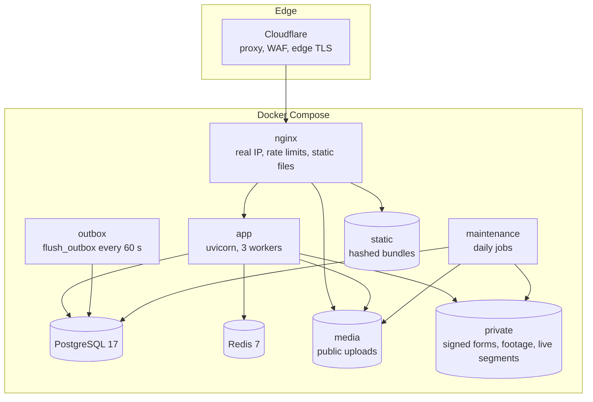
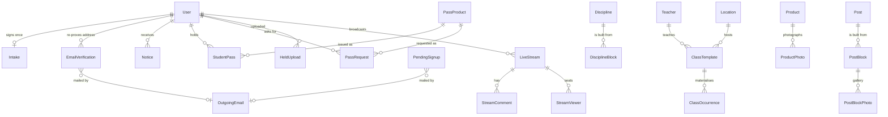
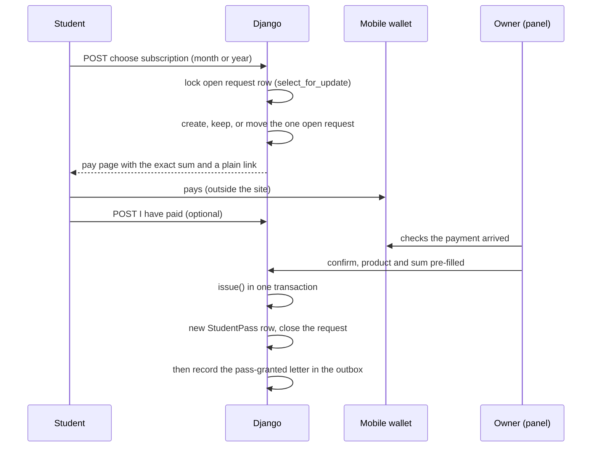

# Architecture

One Django 6.1 project on Python 3.14, served over ASGI by uvicorn behind nginx and Cloudflare. It has eight apps, PostgreSQL for data, and Redis for the cache. There is no task queue and no Node toolchain. This page covers the parts that are not obvious from the README.

## Runtime view

nginx mounts the static volume and the media folder read-only. It never mounts the private folder, so anything in it can only leave through a Django view that checks who is asking.

## Apps

| App | Main models | Notes |
|---|---|---|
| `accounts` | `User`, `PendingSignup`, `EmailVerification`, `Intake`, `Notice` | Email is the login key; `username` is removed. The forms normalise phone numbers to international format, and the column is unique when present. |
| `catalog` | `Location`, `Teacher`, `Discipline`, `DisciplineBlock`, `Course` | Practice pages are ordered blocks. `blocks.py` groups them for layout. `videoserve.py` streams private footage. |
| `core` | `OutgoingEmail`, `SchoolContact` | Outbox, mailer, security headers, image pipeline, private storage, asset bundler, shared abstract models. |
| `journal` | `Post`, `PostBlock`, `PostBlockPhoto`, `Event`, `HeldUpload` | Articles are ordered blocks of nine kinds: text, heading, list, quotation, photograph, gallery, audio, YouTube video and downloadable file. |
| `live` | `LiveStream`, `StreamComment`, `StreamViewer` | See [live-classes.md](live-classes.md). |
| `panel` | none | Views and forms only. Every view is wrapped in one decorator: visitors are sent to sign in, and signed-in users who are not school admins get a 404. |
| `shop` | `Product`, `ProductPhoto` | A catalogue written with the same block editor as articles, limited to the four text kinds; photographs sit on their own strip. No cart and no checkout. |
| `studio` | `ClassTemplate`, `ClassOccurrence`, `PassProduct`, `StudentPass`, `PassRequest` | The timetable and the subscriptions. `issue.py` is the only code that creates a pass. |

## Data model, core relationships

Rules the database enforces, not just the code:

- A weekly class and a dated class must end after they start (check constraints).
- One dated class per template and day (unique constraint), which makes regenerating the timetable idempotent.
- One open payment request per student (partial unique constraint on `status = 'new'`).
- One presence row per stream and viewer (unique constraint).
- A content block belongs to exactly one article or one product, never both and never neither (check constraint).
- A product's description holds only text kinds: text, heading, list and quotation (check constraint). Its photographs live on their own strip.

References that carry history use `PROTECT`. A price card that students bought cannot be deleted, only hidden, so their payment history keeps naming what they paid for.

## Request pipeline

Middleware order, top to bottom:

1. `SecurityMiddleware`: HTTPS redirect, HSTS, `nosniff`, referrer policy.
2. `SessionMiddleware`: cached-database sessions.
3. `LocaleMiddleware`: language from the URL prefix. Hebrew has no prefix.
4. `CommonMiddleware`, `CsrfViewMiddleware`, `AuthenticationMiddleware`, `MessageMiddleware`.
5. `IntakeRequiredMiddleware`: a confirmed student without a signed participation form is redirected to it from any page, on any device. The state is a database column, not a cookie.
6. `XFrameOptionsMiddleware`: `DENY` in production.
7. `HtmxMiddleware`.
8. `SecurityHeadersMiddleware`: mints a per-request nonce for the one inline script and stamps the Content-Security-Policy and Permissions-Policy on every app response.

## Passes and payments

- The wallet has no API and no webhook, so a person confirms every online payment. The site's job is to record who asked for what, for which period and for how much, so the confirmation is one check against the wallet.
- The pay page is reached by a redirect to a page on the site, and the wallet by a plain link. A form post that redirected straight to the wallet was blocked by the `form-action 'self'` CSP directive, which browsers apply across the whole redirect chain.
- Cash, cheques and transfers go through the same `issue()` as wallet payments.
- A renewal is a new row that starts the day after the current pass ends. Every row is one payment for one period, which answers the question the school actually gets asked: "has this student paid for March?"
- Expiry dates are inclusive everywhere. Monthly passes use calendar months, because twelve 31-day windows add up to 372 days, a week more than a year, and the renewal date walks backwards through the calendar.

## Timetable

`ClassTemplate` is the weekly rule: "every Monday 09:00, this teacher, this studio". `ClassOccurrence` is one dated class. Occurrences copy the teacher, place, times and capacity from the template instead of reading through it, so a substitute or a one-off room change is a single edit that never rewrites last month.

- Saving a template grows dated classes 70 days ahead.
- Changing the time, teacher, place or hybrid flag deletes and regrows the future dates still marked scheduled. Dates marked cancelled or full are left alone, and the past is never touched.
- A daily job extends the horizon so the public timetable never runs dry when nobody edits it.
- The week starts on Sunday, and all dates come from `timezone.localdate()` in `Asia/Jerusalem`. `ruff`'s `DTZ` rules reject naive datetimes.

## Content blocks and the composition engine

Practice pages migrated from the old site arrived as long flat lists of paragraphs. That is a good shape for editing and a bad one for layout. `catalog/blocks.py` reads structure out of the content once, in a pure function with 30 tests, and the template renders the groups it returns. Every rule fires on a property of the content, never on which page it is:

- a sentence the old editor split across two paragraphs is rejoined;
- a run of three or more short lines that end in commas, or open with typed dashes, becomes a list;
- paragraphs separated by rows of dots become a set of testimonial cards;
- three or more short headings, each with a one- or two-line note, become a catalogue;
- adjacent photographs become a row, and open in the full-screen viewer only when a frame is at least 600 px wide;
- a bare phone number and the short sentence above it become one call to action.

## Front end

- **Templates.** Server-rendered Django templates. No SPA framework.
- **JavaScript.** 28 vanilla modules, each an immediately invoked function. One bundle loads on every page, so each module looks for its own elements first. They are progressive enhancement. The panel's block editor works as a sequence of form posts without JavaScript, and becomes an in-page document editor with it.
- **CSS.** 40 modules on a token file of colours, type, space and motion. Layout rules use logical properties (`inline-start`, not `left`), so one stylesheet serves right-to-left and left-to-right without a separate RTL stylesheet. The muted text colour was darkened to reach the 4.5:1 contrast floor for normal text. Touch targets grow to 44 px on coarse pointers only.
- **Bidirectional text.** Digit runs (prices, dates, phones) sit in a class that pins them left-to-right inside Hebrew. Free-text inputs get `dir="auto"`, so a title flips direction with its first letter.
- **Bundling.** A Python module concatenates and minifies the CSS and JavaScript lists from settings into one file each, with `rcssmin` and `rjsmin`. On each render it compares source modification times and the module list against a manifest, rebuilds when either changed, and writes atomically. The image build runs it once, and the entrypoint runs it again just before `collectstatic`, so the hashed manifest always points at a fresh bundle.

## Internationalisation

- Hebrew is the default language and the fallback. Translatable models carry explicit `_he`, `_ru` and `_en` columns with a small resolver that falls back to Hebrew.
- URLs use `i18n_patterns` with no prefix for Hebrew. Russian and English are fully wired but stay off until the school decides to publish them. Enabling them is one line in settings.
- Letters are always rendered in Hebrew, whatever language triggered them. Plain-text parts render with HTML escaping off, because in Hebrew the double quote is a letter used in abbreviations, and escaping it put `&quot;` into subject lines.

## Background work

| Job | Schedule | What it does |
|---|---|---|
| `flush_outbox` | every 60 s | Sends due mail and sweeps stuck rows. See [outbox.md](outbox.md). |
| `prune_streams` | daily | Closes broadcasts left live for 6 hours and deletes recordings older than 30 days, files first. |
| `prune_pending` | daily | Deletes used or expired signups and verifications, notices delivered a week ago, and mail sent or cancelled a month ago. |
| `prune_held` | daily | Deletes uploads never attached to a page within a day, with their files. |
| `extend_schedule` | daily | Grows the timetable 70 days ahead. |

Each one can be re-run safely. They run as plain shell loops in two containers built from the app image.
