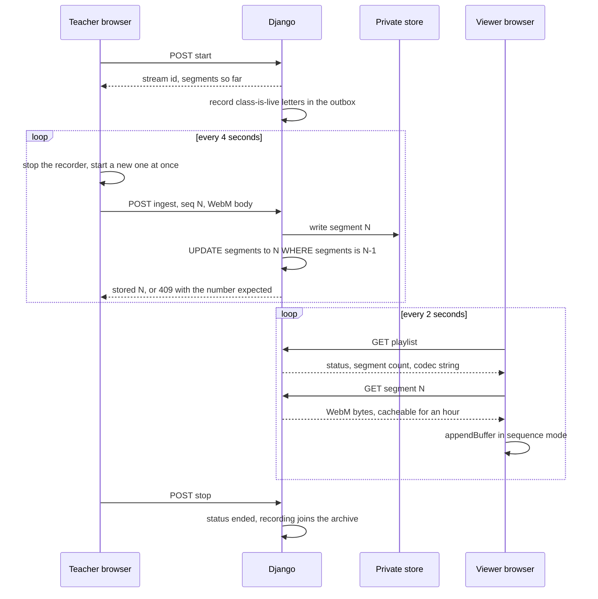

# Live classes without a media server

The school wanted to stream some classes to subscribers and keep the recordings for a month. The usual answer is a media server (RTMP or WebRTC ingest, HLS packaging) or a paid streaming service. Both would be a second system for a non-technical owner to keep alive. This design uses only the browser and the Django app that already exists.

## The idea

A `MediaRecorder` that is stopped and started again every 4 seconds produces a series of small, complete WebM files. Each has its own header and starts on a keyframe. That is enough for:

- a viewer to join in the middle of a class;
- the server to store segments as plain numbered files;
- a recording to be the same segments played from number 1.

It is HLS done by hand, with WebM instead of MPEG-TS and a JSON playlist instead of an `.m3u8`.

## Broadcaster

- `getUserMedia` asks for 1280×720 video and audio. The recorder's MIME type is chosen from the tracks actually present: a class with no microphone produces a video-only stream. Otherwise the player would open a buffer for an audio track that never arrives and refuse the whole stream.
- The next recorder starts before the previous segment is uploaded, so recording never pauses for the network.
- Segments go into an in-order queue. A failed upload waits 1.5 seconds and retries the same segment, so a dropped connection delays the stream but never leaves a gap.
- The exact codec string travels with segment 1 and is returned in the playlist. Viewers open their `SourceBuffer` with that string, because some engines refuse a mismatch on the first segment.
- Reloading the page in the middle of a class picks up at the next segment number.

## Server

- **Strict order.** Ingest accepts only segment `count + 1`. A repeat of the last stored number is answered "stored", so a retry after a lost response does not fork the count. Anything else is a 409 that names the number expected.
- **Atomic count.** The counter moves with `UPDATE ... SET segments = N WHERE segments = N - 1`, never a read-modify-write `save()`, so two racing uploads cannot both write the same number.
- **Private files.** Segments live in the private store under the stream's ID. They are served by a view that checks the viewer's pass on every request.
- **Ceilings.** 30 MB per segment at nginx. 2,700 segments (3 hours) per stream, after which the stream is ended and refuses more data.
- **Unbuffered paths.** nginx turns proxy buffering off for the ingest and segment URLs and the signed-video path, and nowhere else. Large client-paced transfers stream through, while ordinary pages keep buffering so slow readers do not hold a uvicorn worker.

## Viewer

- Media Source Extensions in `sequence` mode, so each appended segment's timestamps follow on from the last one.
- A live viewer joins about two segments behind the newest. A recording starts at segment 1, and the same code plays both.
- During a live class, once more than 90 seconds sit behind the playhead, everything older than 60 seconds is removed from the buffer, so a long class does not fill the device's memory. A recording keeps its buffer for seeking.
- When the class ends and every segment is appended, the player calls `endOfStream()`.

## Comments and presence

- **Polling, not WebSockets.** Comments every 3 seconds, the playlist every 2, and a presence heartbeat every 10. A viewer counts as present for 30 seconds after the last heartbeat.
- The audience is dozens of people, each poll is one indexed query, and no second server process has to be alive at 6 a.m.
- Comment bodies over 2 KB are refused before parsing. Each viewer can post once every 2 seconds, enforced with an atomic cache `add`. Text is capped at 500 characters and rendered with `textContent`, never as HTML.
- The broadcaster's panel shows how many people are watching and who they are, refreshed every 5 seconds.

## Access

- The broadcaster is the school's admin account.
- A viewer needs a pass that is active, has started, has not expired, has credits left if it counts them, and comes from a product flagged as including streams. The check is a single database query. The "class is live" letter goes to the same group, minus anyone who has not opted in to mail.
- Everyone else who is signed in sees a locked page that explains the room and links to the prices.

## Retention and clean-up

- Recordings are listed for 30 days after the class ends, then deleted: files first, then the row. If the job dies in between, the row is still there for the next run to finish, so files are not left behind without a row that points to them.
- A broadcast that nobody stopped, because a laptop was closed or a tab crashed, is closed after 6 hours by the daily job. It then enters the normal archive and deletion path instead of staying "live" and undeletable forever.
- All segment access goes through one storage accessor. Moving the archive to S3-compatible object storage with a lifecycle rule is meant to change that accessor and leave the views alone.

## Limits

- Latency is seconds, not milliseconds. A segment is uploaded only once its 4 seconds are recorded, a viewer learns of it on the next 2-second poll, and a new viewer starts two segments behind the newest as a cushion. That adds up to roughly 12 to 18 seconds behind the room; the figure is derived from those constants, not measured. A yoga class does not notice.
- Quality depends on the broadcaster's upload bandwidth, at about 2.5 Mbit/s of video. There is no transcoding and no adaptive bitrate.
- Browser support is whatever supports `MediaRecorder` with WebM on the camera side and Media Source Extensions with WebM on the viewer side.
