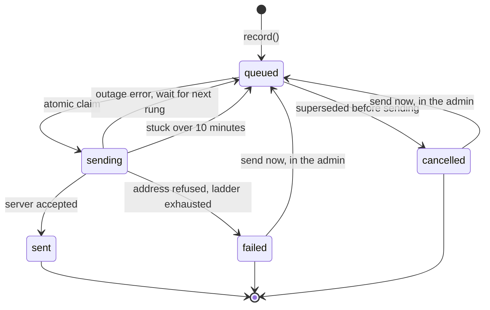

# The email outbox

The site sends verification codes, password resets, "your pass is open" letters, and opt-in letters about new events, schedule changes and live classes. SMTP is a network call to someone else's machine, and it fails for reasons that have nothing to do with the site. A task queue with a broker and workers would cover that, at the cost of more moving parts than a school's mail volume justifies.

The outbox is one table, one function to write to it, and one loop to drain it.

## Rules

1. **Record before sending.** Every message is an `OutgoingEmail` row before any SMTP traffic. A crash between the two leaves a queued row that the pump finishes. A message can never be sent but unrecorded, or recorded but forgotten.
2. **Claim atomically.** A row is claimed with one `UPDATE ... SET status = 'sending' WHERE id = ? AND status = 'queued' AND (next_attempt_at <= now() OR next_attempt_at IS NULL)`. Due-ness is re-checked inside the same statement, so two pumps cannot both send a row, and a stale query cannot fire a retry before its time.
3. **Retry on a ladder whose last rung repeats.** Outage-shaped failures (refused connection, timeout, TLS error, revoked credentials) climb 1, 5, 15, 60, 240, 720 and 1,440 minutes, then retry daily until they go through or someone cancels the row. A letter queued behind a weekend outage is still alive when the outage ends, and goes out on its next daily retry, or at once if someone presses "send now" in the admin.
4. **Give up only on the address.** Only an SMTP rejection of the recipient or sender ends in `failed`, and only after the ladder is exhausted. That is the one failure retrying cannot fix.
5. **Sweep the dead.** A row stuck in `sending` for more than 10 minutes belongs to a process that died mid-conversation, and it goes back to `queued`. The 10 minutes sit well above the 15-second SMTP timeout, so a slow send is never swept and delivered twice. Every transition stamps `updated_at` by hand, because `QuerySet.update()` bypasses `auto_now`.

## Three ways in

| Function | Used for | Behaviour |
|---|---|---|
| `queue()` | Password resets | Record, then try once immediately. On a healthy day the mail leaves before the response renders. |
| `record()` then `deliver()` | Verification codes | Record, link the row to the verification or pending signup, then try once. The link exists before the blocking send, so a crash mid-send still leaves the "check your inbox" page with a row to read. |
| `record()` only | Letters from the mailer: announcements to many students, and the pass-opened letter | Write one row per reader and send nothing inline. A hundred readers do not become a hundred SMTP conversations inside the request that pressed the button. The pump sends them within the minute. |

## Honest status pages

The code entry page reads the linked row's live status. It reports a sending problem only when an attempt has actually failed and the row is still queued, or the row has failed for good. A boolean written once at send time would have lied as soon as the pump delivered the message a minute later.

A resend cancels the previous message if it is still queued. Without that, a resend during an outage would leave two queued messages, and when the outage ended the student would get both, one carrying a code that had just been retired.

## Running it

- In production, the `outbox` container runs `flush_outbox` every 60 seconds. It prints nothing when idle, so cron-style log output carries only the minutes when something happened.
- `flush_outbox` sends at most 50 due rows per run, oldest first.
- Sent and cancelled rows are deleted after 30 days by the daily maintenance job. Queued and failed rows are never pruned.
- The admin lists the table, offers no way to add a row by hand, and doubles as the audit trail for "did the student get the email?". One action, "send now", requeues the selected rows that have not been sent and runs the pump. It skips rows that are in a live SMTP conversation, so a message is never sent twice by hand.

## Why not Celery

The project started from a reference architecture that used Celery. The only background job that survived the design was "retry this email", and a broker plus workers to resend an email a minute is machinery without a machine. The outbox needs nothing but the database the site already has, and it is safe to run from cron, a container loop, or several places at once.
