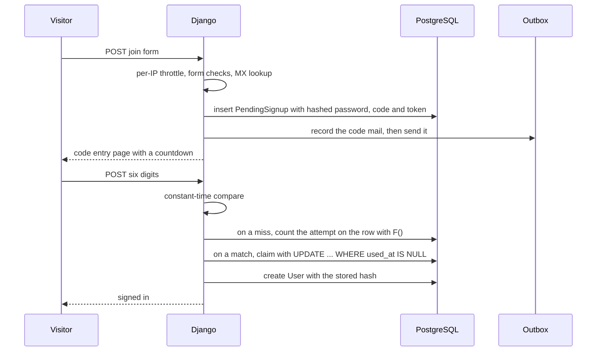
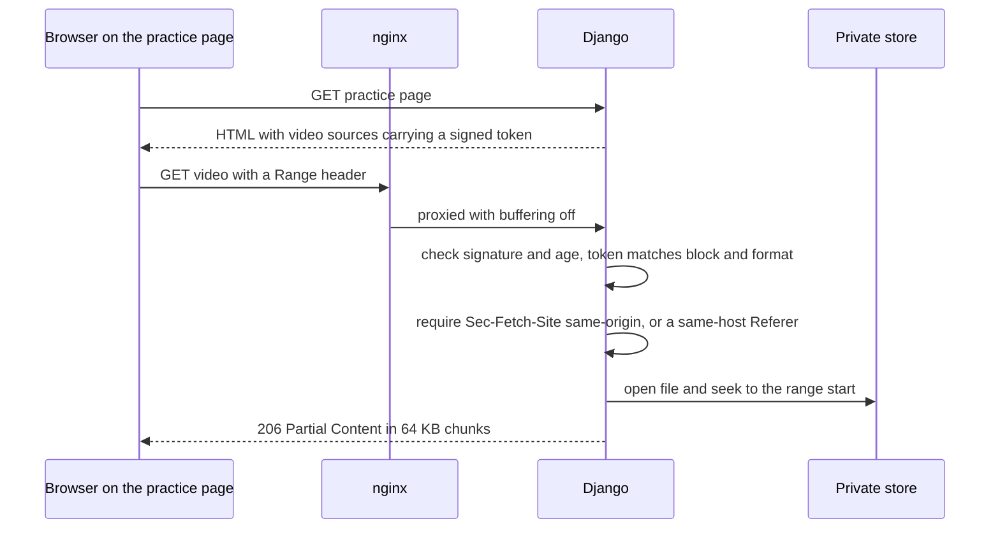

# Security model

The platform holds students' health answers and signatures, their accounts, the school's own video, and the one panel that runs the whole site. It sends mail from the school's single mailbox. This page lists what each layer does and why, and the trade-offs I chose on purpose.

## What is being protected, and from whom

| Asset | Threat |
|---|---|
| Signed participation forms (health answers, signature) | Another student guessing an ID; a template leaking a file URL; copies left on disk after deletion |
| Student accounts | Password guessing; scripts checking which emails or phones have accounts; reset-link phishing through a forged `Host` header |
| The staff panel | Discovery by students; reaching an admin account through an edited URL |
| The school's video | Hot-linking from other sites, a file address copied and shared, casual saving from the browser |
| Mail sending | A script using the reset or join form as a mail cannon that burns the daily quota |
| Server resources | Large bodies aimed at small forms, decompression bombs in images, runaway live recordings filling the disk |
| The deployment | A neighbour container, a client spoofing its IP into the rate limiter, the dev overlay reaching production |

## Edge and nginx

- **Cloudflare** proxies all traffic. The origin uses an origin certificate in Full (strict) mode. The private key was generated on the server, and only the signing request left it. Key and certificate are mounted read-only and are never part of an image layer.
- **Real client IP.** nginx trusts `CF-Connecting-IP` only when the TCP peer is in Cloudflare's published ranges. A direct connection keeps its own address, so the rate limiter still applies to it.
- **No spoofed forwarding headers.** nginx overwrites `X-Forwarded-For` with the restored address instead of appending to it. uvicorn trusts forwarded headers only because nginx is the sole peer that can reach it: the app container publishes no port. The app's throttle reads `REMOTE_ADDR`, and a test checks that a client-supplied `X-Forwarded-For` cannot reset a counter.
- **Rate limits that never touch browsing.** The limit key is the client address for POST requests and empty for everything else, and nginx does not count an empty key. Sign-in, join, password reset and `/admin/` share a zone of 30 requests a minute with a burst of 15. The live email check gets 120 a minute with a burst of 30. Refusals are an honest 429.
- **Body size by location.** 2 MB by default, so a 100 MB body cannot be aimed at the sign-in form. 100 MB for the panel's photo uploads, 30 MB for a live segment. Body and header timeouts are 30 seconds.
- **Uploaded media cannot act.** `/media/` responses carry `Content-Security-Policy: default-src 'none'; sandbox` and `X-Content-Type-Options: nosniff`. The headers are declared inside each location, because nginx's `add_header` does not inherit into a location that sets its own.
- **The private store is not mounted into nginx at all.**
- TLS 1.2 and 1.3 only, session tickets off, `server_tokens off`.

## Django configuration

- `DEBUG` is off unless a variable turns it on. A dropped or misspelt variable fails safe.
- With `DEBUG` off, the app refuses to boot if `SECRET_KEY` is missing or still the development placeholder.
- `ALLOWED_HOSTS` and the CSRF trusted origins derive from one configured domain. Every absolute URL in mail (verification, reset, event and live links) is built from the configured site URL, never from the request's `Host` header.
- HTTPS redirect in production. Session and CSRF cookies are `Secure` and `SameSite=Lax`, and the session cookie is `HttpOnly`. HSTS for one year when the site is configured for HTTPS. `includeSubDomains` and `preload` stay off, because those promises cover more than this site.
- `X-Frame-Options: DENY` in production.

## Response headers

A middleware mints a fresh nonce for every request and adds:

```text
Content-Security-Policy:
  default-src 'self';
  script-src 'self' 'nonce-<per request>';
  style-src 'self' 'unsafe-inline';
  font-src 'self';
  img-src 'self' data: blob: https://i.ytimg.com;
  media-src 'self' blob:;
  frame-src https://maps.google.com https://www.google.com;
  connect-src 'self';
  object-src 'none';
  base-uri 'self';
  form-action 'self';
  frame-ancestors 'none'

Permissions-Policy:
  camera=(self), microphone=(self), geolocation=(), payment=(), usb=(), interest-cohort=()
```

- Everything the site loads is same-origin: the bundle, the fonts, the images and the private video. The exceptions are studio maps in an iframe, YouTube poster images, and the `blob:` URL that Media Source Extensions hands to the live player.
- One inline script exists, and it carries the nonce.
- Camera and microphone are allowed to this origin only, for the broadcaster's `getUserMedia`.
- Two relaxations exist in development only, for the layout harnesses: same-origin framing and `unsafe-eval`. Production gets neither.

## Authentication

### Deferred signup



- Nothing about a person exists until the address is proven: no `User`, no signed-in session, nothing to sign in to. The password is hashed inside the request that validated it, and the plaintext never reaches the database.
- The code is 6 digits from `secrets.randbelow`, lives 7 minutes and allows 6 attempts. Attempts are counted on the database row with an `F()` update, so reloading the page does not reset them. The comparison is `secrets.compare_digest`.
- The mail also carries a 48-hour link with a 256-bit token. The code and the link claim the same row with a single `UPDATE`, so racing them, or opening the link in two tabs, creates one account.
- A resend retires earlier codes and cancels their mail if it has not left yet. Otherwise an outage could deliver two messages, one with a dead code.
- A second click on a used link says "already confirmed" only if the account really is confirmed. A link retired by a newer one says so instead.

### Sign-in, reset and enumeration

- Sign-in shows one message for an unknown address and a wrong password.
- The "reset link sent" page appears for any address. Reset links last 3 hours and do not sign the person in. Reset mail goes through the outbox like every other message.
- Changing the email address un-verifies the account and sends a fresh link to the new address.
- `next=` redirects pass Django's `url_has_allowed_host_and_scheme` against the current host, which rejects other hosts, protocol-relative URLs and `javascript:` URLs.

### Throttles

| Counter | Key | Limit | Window | Then |
|---|---|---|---|---|
| Sign-in failures | account | 8 | 15 min | 10-minute pause |
| Sign-in failures | IP | 30 | 15 min | 10-minute pause |
| Join submissions | IP | 20 | 15 min | 10-minute pause, before any MX lookup |
| Reset requests | IP | 15 | 15 min | 10-minute pause |
| Live email check | IP | 40 | 15 min | Endpoint quietly answers "fine"; the submit still re-checks |

The counter is cleared when the pause starts, so one more mistake after a pause does not trigger another. A correct password clears the account counter but not the IP counter.

### Email deliverability check

A domain has to have the shape of a domain, must not be a known typo (`gmial.com` gets a "did you mean" suggestion), must not be a disposable-mail domain, and must answer an MX lookup, with an A-record fallback. Answers are cached for 24 hours. If DNS itself fails, the check lets the address through, and the verification mail is the backstop. It never probes mailboxes with SMTP `RCPT TO`.

## Authorisation

- One predicate, `is_school_admin`, is true for staff or the admin role. It guards the panel, the broadcast side of the live room, access to any participation form, and exemption from the participation-form gate. One test in one place means the doors cannot disagree.
- The panel answers **404** to anyone else, so a student does not learn it exists. Visitors who are not signed in are sent to sign in.
- Student-management screens find people through the student roll, which excludes staff and admins. Changing an ID in the URL cannot open or delete an administrator's account.
- An uploaded file waits under a token. It is claimed by token **and** owner, so one person's token cannot attach a file to another person's page or account.
- Block actions (move, delete, remove a photo) look IDs up among the current page's own blocks only. An ID from another page does nothing.
- The live room shows a locked page to signed-in students without a streaming pass. Its JSON and segment endpoints answer 404 to them, and the ingest and viewer-list endpoints answer 404 to anyone but the broadcaster.

## Files

### Private storage

A storage class whose `url()` raises. A `{{ obj.file.url }}` slipped into a template becomes an error on the developer's screen, not a public link. The location is read from settings on every access, so tests write to a temporary folder and never next to real files.

### Participation forms (health data)

- Signature and PDF files are named with random UUIDs and stored privately.
- They are downloadable only by the student who signed or by an admin, through a view that checks this on every request. Any other signed-in user gets a 404, and visitors are sent to sign in.
- The canvas signature arrives as a data URL. It must carry the PNG prefix, stay under 300 KB, decode as strict base64, and pass Pillow's `verify()`. It is then re-opened and re-encoded, so the server stores pixels it rasterised, never bytes the browser sent. A blank canvas is refused.
- Re-rendering a PDF deletes the previous file once the new one is saved. Deleting a student from the panel deletes their avatar, signature and PDF from disk, because Django deletes rows and leaves files behind.
- Both `.gitignore` and `.dockerignore` exclude the private folder.

### Signed video



- The token is a salted `TimestampSigner` signature (HMAC) over the block ID and format, valid for 6 hours. An expired token and a forged one get different messages, because the first needs a reload and the second does not deserve one.
- `Sec-Fetch-Site` is set by the browser and cannot be set by page script. A URL pasted into the address bar reports `none` and is refused. Older browsers fall back to a Referer host check. A request with neither header is refused.
- A script or download tool can send any header it likes. The origin check stops hot-linking from other sites and a shared address opened in a browser; it does not stop a determined downloader.
- Range parsing handles `bytes=a-b`, open-ended ranges and suffix ranges. A range past the end of the file is a 416 with `Content-Range: bytes */size`, not a restart from zero.
- Responses carry `Cache-Control: private, max-age=0, no-store`, `Content-Disposition: inline` and `nosniff`.
- The view also requires the practice page to be published, and the format to match a file that exists.

This defends the address. It does not stop a screen recorder, and the code says so.

### Uploads

- Every image field goes through one pipeline on save. It applies the EXIF rotation to the pixels, flattens transparency, caps the long edge (400 to 2,000 px by role) and re-encodes to WebP with no EXIF or ICC data, so phone GPS coordinates are not republished. Two exceptions: a file that already arrives as WebP is kept as sent, and a file the pipeline cannot read is left in place instead of failing the save.
- Panel uploads are capped at 90 MB per file and 60 waiting files per person. Pictures are rejected above 60 megapixels and must pass Pillow's `verify()` before anything decodes them, because a few kilobytes can declare a hundred-million-pixel image.
- Documents and audio are matched against extension allow-lists: 13 document and archive types (PDF, Office and OpenDocument files, RTF, plain text, ZIP) and 8 audio types (MP3, M4A, AAC, WAV, Ogg, Opus, FLAC and OGA). Nothing a browser would run is accepted. Files are stored byte for byte and served from `/media/` under the sandbox policy above.
- Replacing or removing a file deletes the old one from disk.

## Abuse limits in the live room

- Only the broadcaster can upload segments. nginx caps each upload at 30 MB.
- A recording stops at 2,700 segments, which is 3 hours. A tab left recording is cut off there instead of writing until the disk PostgreSQL shares is full.
- Comments must declare and send at most 2 KB, checked before the body is parsed. Each viewer can post one every 2 seconds, and comments are capped at 500 characters.
- Broadcasts left live are closed after 6 hours, and recordings are deleted after 30 days.

## Containers and supply chain

- The app runs as an unprivileged user created in the image.
- The runtime environment arrives through Compose. `.env` files, the database, media and private folders are excluded from the build context.
- Redis requires a password even on the private bridge network, to limit the damage a compromised neighbour container could do. It is capped at 128 MB with LRU eviction.
- Container logs are capped at 10 MB × 5 files per service, so a log flood cannot fill the disk.
- In production, only nginx publishes ports. The dev overlay alone publishes PostgreSQL, on port 5433.
- `make deploy` runs the base Compose file alone. A plain `docker compose up` would merge the dev overlay, with `DEBUG`, runserver, the open mail-catcher UI and a published database.
- All 13 direct dependencies are pinned to exact versions. Pillow and pillow-heif are pinned at versions that fix advisories reachable through image uploads, and the requirements file says which ones.
- `make audit` freezes the packages actually installed in the image (52 at the time, against 13 direct pins) and runs `pip-audit` on that list in a throwaway container, so the auditor never becomes a dependency of the thing it audits.
- `ruff` runs pycodestyle, pyflakes, isort, bugbear, simplify, bandit (`S`), naive datetimes (`DTZ`), blind excepts (`BLE`), pyupgrade, perflint and pylint errors. A blind `except` has to carry a written justification.
- An overridden `collectstatic` leaves the development layout harnesses out of the collected static files, so keeping them out of a production build is not a step anyone has to remember.

## Trade-offs I chose deliberately

- **Throttle counters live in the cache, not the database.** A failed password is not a fact worth a row, and the windows are minutes long. The nginx limits are the coarse outer layer, and they do not depend on the cache.
- **The join form tells you when an address already has an account.** On a school of a few hundred people that is help, not an oracle worth hiding. Join submissions are limited per IP, and the sign-in and reset forms reveal nothing.
- **The password policy is the school's**: at least 8 characters, a digit and a capital letter, shown as a live checklist while the person types. Django's common-password, numeric and similarity validators are not used, because a rule the checklist cannot show fails people at submit time without warning. The throttles carry more of the weight as a result.
- **`style-src` allows inline styles**, because templates set aspect ratios and backgrounds with style attributes. `script-src` stays nonce-only.
- **Video protection is about the address, not the bytes.** DRM would need a licence server and packaged streams, which is the wrong cost for a few short clips.
